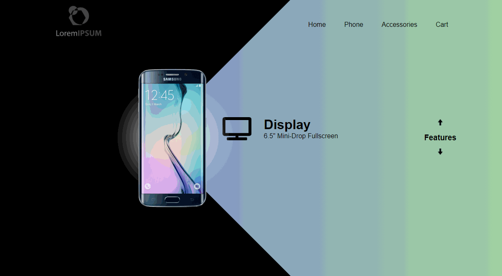

# Phone_promo

Unique way to promote product features.

## Deployed Link

gh_pages: https://mesgt.github.io/bulb/

# Application Details

## Purpose

Bulb is a small project to show interesting and unique way of promoting various phone features to the user. 

## Description 

The website primarily uses HTML and CSS to display various phone features using an onclick event.

## Future Developments 

Ideas for future development include:
    1. Navlinks to be functional with additional phone displayed
    2. Landing page
    3. Accessories that can be added to the phone order
    4. E-commerse feature

## License
Licensed under the [MIT](https://opensource.org/licenses/MIT) license.

## Contributing
I would like to welcome you to work with me on improving this project. Feel free to contact me on gitHub or submit a pull request.

Please note that this project is released with a Contributor Code of Conduct. By participating in this project you agree to abide by its terms.

If you are interested in collaborating with me on this project, please visit (https://www.contributor-covenant.org/version/2/0/code_of_conduct/) to review the latest version of Contributor Covenant. In Node.js, please run the following command "npm install -g covgen" and "covgen '<your_email_address>'". If you have npm 5.x installed you can run npx covgen <your_email_address> instead of installing globally.